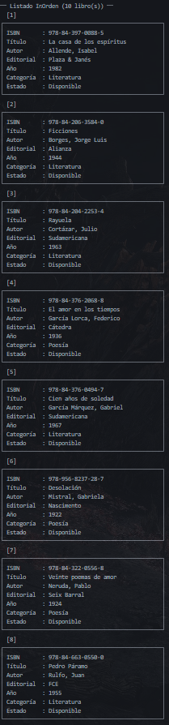

#  Sistema de Gestión de Biblioteca — BST en Java

Sistema de gestión de catálogo bibliotecario universitario implementado con un **Árbol Binario de Búsqueda (BST)** en Java, organizado por apellido del autor. Permite insertar, buscar, eliminar y listar libros eficientemente, además de gestionar préstamos y devoluciones.

---

##  Estudiante

| Campo | Detalle |
|---|---|
| **Nombre completo** | Angel Samuel Roa Cuellar |
| **Asignatura** | Estructuras de Datos |
| **Entrega** | Parcial 2 |

---

##  Estructura del Proyecto

```
Biblioteca-bst/
└── src/
    ├── modelo/
    │   ├── Libro.java          # Clase de datos del libro
    │   └── NodoBST.java        # Nodo del árbol binario
    ├── estructura/
    │   └── ArbolBST.java       # Implementación del BST
    ├── servicio/
    │   └── BibliotecaService.java  # Lógica de negocio y préstamos
    └── vista/
        └── MenuPrincipal.java  # Main + menú interactivo de consola
```

---

##  Requisitos

- Java **8 o superior**
- JDK instalado y configurado en el `PATH`

Verifica tu versión con:
```bash
java -version
javac -version
```

---

##  Compilación y Ejecución

### 1. Clonar el repositorio

```bash
git clone https://github.com/rollthoqui/biblioteca-BST-Java-ParcialDos.git
cd biblioteca-BST-Java-ParcialDos/Biblioteca-bst
```

### 2. Compilar todos los archivos

Desde la carpeta `src/`:

```bash
cd src
javac modelo/*.java estructura/*.java servicio/*.java vista/*.java
```

### 3. Ejecutar el programa

```bash
java vista.MenuPrincipal
```

> Al iniciar, el sistema carga automáticamente **10 libros de prueba** con autores latinoamericanos para demostrar el funcionamiento del BST.

---

##  Menú del Sistema

```
============================================
   SISTEMA DE GESTIÓN DE BIBLIOTECA (BST)
============================================
  1.  Registrar nuevo libro
  2.  Buscar libro por autor
  3.  Buscar libro por ISBN
  4.  Eliminar libro del catálogo
  5.  Listar libros (InOrden - alfabético)
  6.  Listar libros (PreOrden - estructura)
  7.  Listar libros (PostOrden)
  8.  Registrar préstamo de libro
  9.  Registrar devolución de libro
 10.  Listar libros disponibles
 11.  Listar libros prestados
 12.  Buscar libros por categoría
 13.  Estadísticas del catálogo
  0.  Salir
============================================
```

---

##  Operaciones del BST

| # | Operación | Descripción | Complejidad |
|---|-----------|-------------|-------------|
| 1 | `insertar(Libro)` | Inserta un libro ordenado por apellido del autor | O(log n) prom. |
| 2 | `buscar(autor)` | Busca un libro por apellido del autor | O(log n) prom. |
| 3 | `eliminar(autor)` | Elimina un nodo manejando los 3 casos clásicos | O(log n) prom. |
| 4 | `recorridoInOrden()` | Lista libros en orden alfabético por autor | O(n) |
| 5 | `recorridoPreOrden()` | Muestra la estructura jerárquica del árbol | O(n) |
| 6 | `recorridoPostOrden()` | Recorrido útil para operaciones de limpieza | O(n) |
| 7 | `encontrarMinimo()` | Autor alfabéticamente primero | O(log n) prom. |
| 8 | `encontrarMaximo()` | Autor alfabéticamente último | O(log n) prom. |
| 9 | `contarNodos()` | Total de libros en el catálogo | O(n) |
| 10 | `altura()` | Altura actual del árbol | O(n) |

---

##  Funcionalidades de Biblioteca

-  **Registrar préstamo** — marca el libro como no disponible y guarda el nombre del estudiante y la fecha.
-  **Registrar devolución** — restaura el estado disponible del libro.
-  **Listar disponibles / prestados** — filtra el catálogo por estado.
-  **Buscar por ISBN** — recorrido completo del árbol por código ISBN.
-  **Buscar por categoría** — filtra libros por género o área temática.
-  **Estadísticas** — total de libros, altura del árbol, primer y último autor, disponibles y prestados.

---

##  Manejo de Excepciones

El sistema valida y controla las siguientes situaciones:

- Intento de insertar un autor duplicado en el árbol.
- Búsqueda de un autor o ISBN que no existe.
- Préstamo de un libro que ya está prestado.
- Devolución de un libro que no figura como prestado.
- Eliminación de un libro actualmente prestado.
- Entradas vacías o no numéricas desde el menú.

---

##  Capturas de Pantalla

### Menú principal

> 

### Listado InOrden (alfabético)

> 

### Estadísticas del catálogo

> 

---

##  Notas

- El sistema utiliza como criterio de ordenamiento el **apellido del autor** en formato `Apellido, Nombre`.
- Los datos de prueba se cargan automáticamente al iniciar e incluyen autores como García Márquez, Borges, Neruda, Cortázar, entre otros.
- La búsqueda por autor es **case-insensitive**, por lo que no importa si escribes en mayúsculas o minúsculas.
